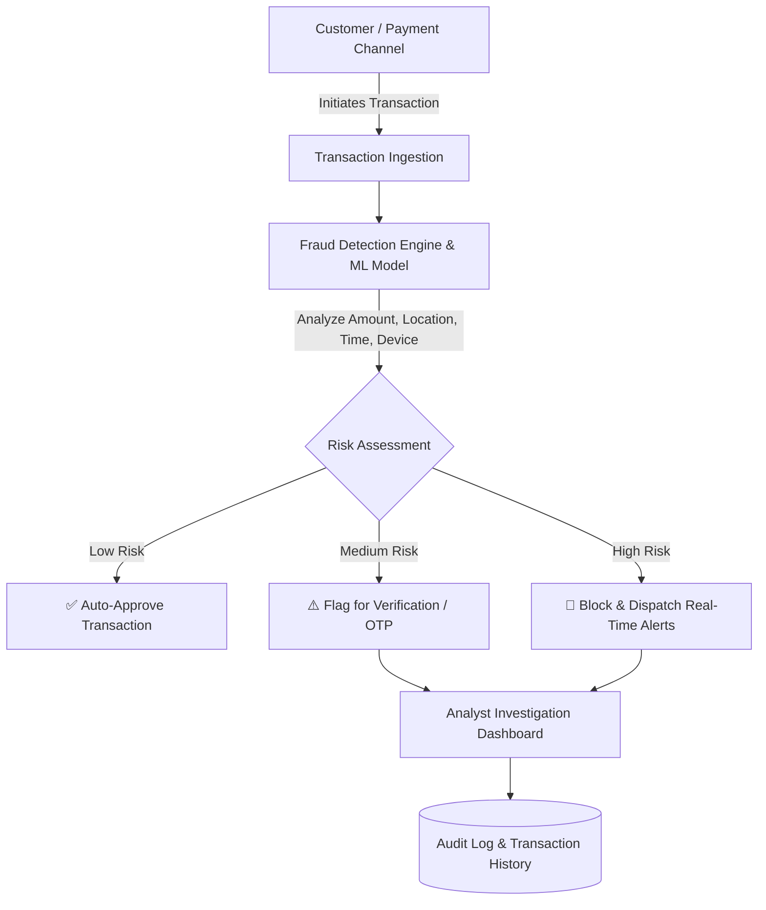

# 🛡️ Fraud Detection System & Dashboard

A comprehensive, intelligent system designed to monitor transactions, calculate risk scores, and identify fraudulent or suspicious activities in real-time to minimize financial losses and enhance transaction security.

---

## 📌 Table of Contents
- [Overview](#-overview)
- [Key Objectives](#-key-objectives)
- [System Architecture & Workflow](#-system-architecture--workflow)
- [Target User Personas](#-target-user-personas)
- [Functional & Non-Functional Requirements](#-functional--non-functional-requirements)
- [Requirement Traceability Matrix (RTM)](#-requirement-traceability-matrix-rtm)
- [Repository Structure](#-repository-structure)
- [Future Scope & Roadmap](#-future-scope--roadmap)
- [Project Team & Credits](#-project-team--credits)

---

## 📖 Overview

The **Fraud Detection System** is designed to analyze incoming financial transactions using behavioral heuristics, predefined rules, and machine learning models. By evaluating parameters such as transaction amounts, frequency, timestamps, geolocation, and device fingerprints, the system accurately classifies transactions into risk categories and alerts stakeholders.

---

## 🎯 Key Objectives

- **Early Fraud Detection:** Identify anomalous transactions in near real-time.
- **Loss Mitigation:** Prevent unauthorized transfers and lower financial risk for both users and financial institutions.
- **Behavioral Pattern Analysis:** Establish baseline user behaviors and flag irregular anomalies (e.g., sudden large amounts from unusual locations).
- **Automated Risk Scoring & Classification:** Categorize transactions into *Low Risk (Genuine)*, *Medium Risk (Suspicious)*, and *High Risk (Fraudulent)*.
- **Investigator Enablement:** Provide fraud analysts with investigative dashboards, contextual data, and audit histories.

---

## 🔄 System Architecture & Workflow



### Risk Classification Tiers:
| Risk Level | Action Taken | Scenario Example |
| :--- | :--- | :--- |
| **Low Risk (Genuine)** | Instant Approval | Regular grocery purchase within typical user location |
| **Medium Risk (Suspicious)** | Step-up Auth / Verification | Transaction slightly outside standard spending limits or new device |
| **High Risk (Fraudulent)** | Immediate Block & Alert | Sudden ₹80,000 international transfer from an unknown device |

---

## 👥 Target User Personas

| Persona | Role | Key Needs & Goals |
| :--- | :--- | :--- |
| **Rahul** | Customer | Instant security notifications, clean transaction history, hassle-free genuine payments. |
| **Priya** | Fraud Analyst | Clear risk breakdown, suspicious alert feeds, quick-action investigation dashboard. |
| **Amit** | System Administrator | Role-based access control, rule management, and system uptime monitoring. |
| **Manager** | Business / Bank Manager | Aggregate fraud reports, financial loss prevention analytics, and performance KPIs. |

---

## 📋 Functional & Non-Functional Requirements

### Functional Requirements (FR)
- **FR1 — Authentication & Authorization:** Secure role-based login for Customers, Analysts, and Admins.
- **FR2 — Transaction Ingestion & Monitoring:** Real-time ingestion of transaction metadata.
- **FR3 — Fraud Detection:** Detection of fraudulent patterns via rules and ML classifiers.
- **FR4 — Risk Scoring Engine:** Generate a numerical risk score for every transaction.
- **FR5 — Transaction Classification:** Categorize transactions as *Genuine*, *Suspicious*, or *Fraudulent*.
- **FR6 — Alerting & Notification:** Multi-channel alert dispatch (SMS, Email, Dashboard Notifications).
- **FR7 — Transaction History:** Maintain immutable transaction logs for audit trails.
- **FR8 — Investigation Workspace:** Dedicated interface for fraud analysts to inspect and resolve flagged items.
- **FR9 — Reporting & Insights:** Exportable reports and visual analytics for management.
- **FR10 — User & Rule Management:** Administrative interface to configure detection rules and manage system users.

### Non-Functional Requirements (NFR)
- **NFR1 — Security:** End-to-end data encryption and compliance with data privacy standards.
- **NFR2 — Performance:** Sub-second transaction evaluation latency.
- **NFR3 — Reliability:** Resilient fallback rules in case of auxiliary service downtime.
- **NFR4 — Scalability:** Capable of processing high transaction throughput during peak volume.
- **NFR5 — Usability:** Intuitive, modern dashboard UI tailored for rapid decision-making.
- **NFR6 — Accuracy:** Optimized model precision and recall to minimize false positives and false negatives.

---

## 🔗 Requirement Traceability Matrix (RTM)

| ID | Requirement Description | Target Stakeholders | Priority | Source |
| :--- | :--- | :--- | :--- | :--- |
| **FR1** | User Login & Authentication | Customer, Administrator | High | System Requirement |
| **FR2** | Real-Time Transaction Monitoring | Fraud Analyst | High | Observation / Interview |
| **FR3** | Fraud Detection Engine | Fraud Analyst, Manager | Critical | Questionnaire / Core Spec |
| **FR4** | Risk Score Generation | Fraud Analyst | High | Interview |
| **FR5** | Transaction Classification | Fraud Analyst | High | Core Spec |
| **FR6** | Fraud & Suspicious Alerts | Customer, Fraud Analyst | Critical | Questionnaire |
| **FR7** | Transaction History & Audit | Customer, Fraud Analyst | Medium | User Persona |
| **FR8** | Fraud Investigation Console | Fraud Analyst | High | Analyst Interview |
| **FR9** | Fraud Analytics & Reports | Manager | Medium | Manager Interview |
| **FR10** | Admin & Rule Management | Administrator | Medium | Admin Persona |

---

## 📁 Repository Structure

```text
fraud_dashboard/
├── report.md       # Detailed Software Requirements & Elicitation Report
└── README.md       # Project Overview, Architecture, and Requirements Summary
```

---

## 🚀 Future Scope & Roadmap

- [ ] Implementation of Machine Learning classification pipelines (e.g., XGBoost / Random Forest / Neural Networks).
- [ ] Interactive Web Dashboard for Fraud Analysts built with modern web UI.
- [ ] Real-time WebSocket streaming for transaction monitoring.
- [ ] Integration with SMS/Email gateways for automated multi-factor verification.

---

## 👥 Project Team & Credits

- **Project Title:** Fraud Detection System
- **Submitted To:** Ms. Karuna Kaushik
- **Submission Date:** September 10, 2026

### 👨‍💻 Team Members
- **Akshay Pratab Singh**
- **Anjali Gupta**
- **Anjali Gehra**
- **Anchal Yadav**
