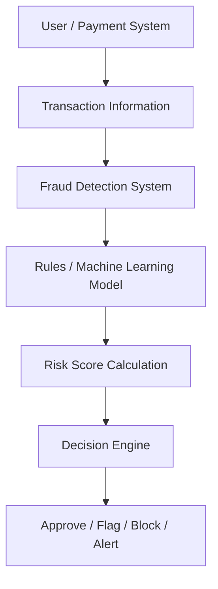

# Software Requirements Specification (SRS)
## Fraud Detection Management Dashboard

---

### Document Information
- **Project Title:** Fraud Detection Management Dashboard
- **Document Type:** Software Requirements Specification
- **Version:** 1.0
- **Date:** 10/09/2026
- **Prepared By:** Akshay Pratap Singh, Anjali Gupta, Anchal Yadav, Anjali Gehra
- **Submitted To:** Ms. Karuna Kaushik

---

## 1. Introduction

### 1.1 Purpose
This document describes the functional and non-functional requirements of the **Fraud Detection Management Dashboard**. The system is designed to identify potentially fraudulent transactions, analyze their risk, generate alerts, and support fraud analysts in investigating suspicious activities.

### 1.2 Scope
The system will receive transaction information, analyze it using predefined fraud detection rules and/or machine learning techniques, and classify transactions as **Genuine**, **Suspicious**, or **Fraudulent**. It will also provide transaction history, fraud alerts, investigation features, and reports.

### 1.3 Intended Users
- **Customer / User:** Views transactions and receives fraud alerts.
- **Fraud Analyst:** Monitors transactions and investigates suspicious activities.
- **Manager:** Views fraud reports and overall statistics.
- **Administrator:** Manages users, rules, and system access.

---

## 2. Overall Description

### 2.1 Product Perspective
The Fraud Detection Management Dashboard is a transaction-monitoring system that works with a bank or payment system. It analyzes transaction-related information and produces a risk-based decision.

### 2.2 Basic System Flow

### 2.3 Product Functions
The main functions of the system are:
1. **User Registration & Login:** Secure authentication and role-based access.
2. **Transaction Monitoring:** Real-time analysis of transaction data.
3. **Fraud Detection:** Automated detection of anomalous and fraudulent patterns.
4. **Risk Score Generation:** Assignment of a normalized risk score per transaction.
5. **Transaction Classification:** Tagging transactions as Genuine, Suspicious, or Fraudulent.
6. **Fraud Alert Generation:** Instant dispatch of alerts upon detecting anomalies.
7. **Transaction History Management:** Logging and tracking historical records.
8. **Fraud Investigation:** Interactive toolset for analyst case review.
9. **Report Generation:** Comprehensive statistics and risk reporting for management.
10. **User Management:** Administrative control over users, roles, and rules.

### 2.4 User Classes & Characteristics

| User Class | Description |
| :--- | :--- |
| **Customer** | Makes transactions and views personal transaction history. |
| **Fraud Analyst** | Reviews fraud alerts, inspects metrics, and investigates suspicious transactions. |
| **Manager** | Views high-level fraud reports, trends, and risk statistics. |
| **Administrator** | Manages system users, configures detection rules, and handles access permissions. |

---

## 3. Specific Requirements

### 3.1 Functional Requirements

- **FR1 — User Registration/Login:** The system shall allow authorized users to securely log in.
- **FR2 — Transaction Monitoring:** The system shall monitor and analyze transaction details.
- **FR3 — Fraud Detection:** The system shall identify potentially fraudulent transactions.
- **FR4 — Risk Score Generation:** The system shall generate a risk score for each transaction.
- **FR5 — Transaction Classification:** The system shall classify transactions as:
  - Genuine
  - Suspicious
  - Fraudulent
- **FR6 — Fraud Alert:** The system shall notify users or fraud analysts when suspicious activity is detected.
- **FR7 — Transaction History:** The system shall maintain transaction history for analysis.
- **FR8 — Fraud Investigation:** The system shall allow fraud analysts to view and investigate suspicious transactions.
- **FR9 — Reports:** The system shall allow managers or administrators to generate fraud detection reports.
- **FR10 — User Management:** The system shall allow administrators to add, remove, and manage users.

---

### 3.2 Non-Functional Requirements

| ID | Requirement | Description |
| :--- | :--- | :--- |
| **NFR1** | **Security** | The system shall protect sensitive transaction and user information. |
| **NFR2** | **Performance** | The system shall analyze transactions within a reasonable response time. |
| **NFR3** | **Reliability** | The system shall provide consistent and accurate results. |
| **NFR4** | **Scalability** | The system shall be capable of handling a large number of transactions. |
| **NFR5** | **Availability** | The system shall be available whenever transaction monitoring is required. |
| **NFR6** | **Usability** | The interface shall be simple and easy to understand. |
| **NFR7** | **Maintainability** | The system shall be easy to update and maintain. |
| **NFR8** | **Accuracy** | The fraud detection model shall minimize false positives and false negatives. |

---

## 4. External Interface Requirements

### 4.1 User Interface
The system shall provide a dashboard for viewing transaction information, fraud alerts, risk scores, and reports. Fraud analysts shall be able to access investigation-related information.

### 4.2 Software Interface
The system shall receive transaction information from a bank or payment system and use fraud detection rules and/or a machine learning model for analysis.

### 4.3 Communication Interface
The system shall support notifications for suspicious transactions through available notification channels such as email, SMS, or dashboard alerts.

---

## 5. System Requirements

### 5.1 Hardware Requirements
*Proposed baseline specifications for project deployment:*

| Component | Minimum Requirement |
| :--- | :--- |
| **Processor** | Intel Core i3 or equivalent |
| **RAM** | 4 GB |
| **Storage** | 10 GB available space |
| **Display** | Standard monitor |
| **Internet** | Required for web-based deployment |

### 5.2 Software Requirements
*Proposed software environment specifications:*

| Software Layer | Requirement |
| :--- | :--- |
| **Operating System** | Windows / Linux |
| **Frontend** | Web-based dashboard |
| **Backend** | Server-side application |
| **Database** | Database for users and transactions |
| **Development Tools** | VS Code or equivalent |
| **Browser** | Google Chrome / Microsoft Edge / Mozilla Firefox |

---

## 6. Use Case Summary

| Actor | Use Cases |
| :--- | :--- |
| **Customer** | Login, View Transaction History, View Dashboard |
| **Fraud Analyst** | Login, Monitor Transactions, Review Alerts, Investigate Fraud, Manage Cases, Generate Reports |
| **Manager** | View Reports, View Dashboard |
| **Administrator** | Login, Manage Users, Manage Detection Rules, View Reports |
| **Bank / Payment System** | Provide Transaction Data, Send Notifications |

---

## 7. Requirement Traceability Matrix (RTM)

| Requirement ID | Requirement Description | Stakeholder |
| :--- | :--- | :--- |
| **FR1** | User Login | Customer, Administrator |
| **FR2** | Transaction Monitoring | Fraud Analyst |
| **FR3** | Fraud Detection | Fraud Analyst, Manager |
| **FR4** | Risk Score Generation | Fraud Analyst |
| **FR5** | Transaction Classification | Fraud Analyst |
| **FR6** | Fraud Alerts | Customer, Fraud Analyst |
| **FR7** | Transaction History | Customer, Fraud Analyst |
| **FR8** | Fraud Investigation | Fraud Analyst |
| **FR9** | Fraud Reports | Manager |
| **FR10** | User Management | Administrator |

---

## 8. Constraints and Assumptions

- The system depends on the availability of transaction information.
- Fraud detection results depend on the quality of the rules and/or machine learning model.
- The system is intended to support fraud detection and investigation.
- Access to system features depends on the user's role.
- The exact technology stack and deployment environment will be finalized during implementation.

---

## 9. Conclusion

The **Fraud Detection Management Dashboard** is designed to identify suspicious and fraudulent transactions efficiently. It provides transaction monitoring, risk analysis, fraud alerts, investigation support, and reporting features. The functional and non-functional requirements define the expected behavior and quality of the system.
